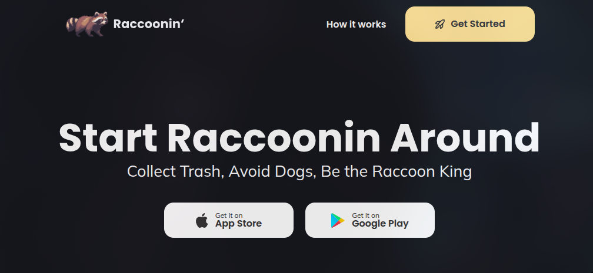

# 🦝 Landing Page - Raccoonim

Учебный лендинг для мобильной игры про енота

---

## 🚀 Функционал

- Хедер с логотипом, навигацией и CTA-кнопкой
- Hero-секция с заголовком и кнопками App Store / Google Play
- Секция превью с иллюстрацией игры
- Секция с тремя feature-карточками
- Секция кастомизации персонажа с advice-боксами
- Секция с тремя игровыми мирами
- Футер с копирайтом и иконками соцсетей
- Адаптивная вёрстка на 5 брейкпоинтов
- Fluid typography через `clamp()` на всех текстовых элементах
- `focus-visible` для keyboard accessibility
- Hover-анимации на кнопках, карточках и иконках

---

## 🛠 Стек технологий

- HTML5
- CSS3 / SCSS
- Методология: BEM + utility-классы
- Flexbox
- `clamp()` для fluid typography и fluid sizing
- Git & GitHub

---

## 📸 Скриншоты

> 

---

## ⚙️ Запуск проекта

```bash
git clone https://github.com/xamiuez/landing-raccoonin.git
cd landing-raccoonin
```

Открыть `src/index.html` в браузере.

---

## 📌 Планы по улучшению

**BEM**

- `customization-section__advice-box-1 / -2 / -3` - номера в именах классов нарушают BEM, все три это один и тот же блок `.advice-box`
- `features-section__first-card / __second-card / __third-card` - то же самое, заменить на единый модификатор или убрать совсем
- Utility-классы (`u-no-underline`, `u-rounded-lg`) смешаны с BEM в одном файле `_components.scss` - лучше вынести в `_utilities.scss`

**SCSS**

- `@font-face` в `_variables.scss` - вынести в `_typography.scss`
- `font-display: swap` есть только у `Poppins-SemiBold`, добавить для `Mulish-Regular` и `Poppins-Bold`
- Два пересекающихся брейкпоинта: `max-width: 1200px` (width: 1140px) и `max-width: 1199px` (width: 960px) - разница в 1px, убрать первый
- Шрифты `.ttf` → конвертировать в `.woff2`

**HTML / семантика**

- Нет `<meta name="description">`
- `alt=""` у всех карточек, advice-боксов и иконок футера - добавить осмысленные описания
- `alt=""` и `title=""` пустые у `customization-section__left-wrapper img` - заполнить
- Пробелы в именах файлов изображений: `Game Section.png`, `Visuals.png` → `game-section.png`, `visuals.png`
- Favicon подключён через `./src/icons/fav/...` но CSS подключён через `./css/main.css` - пути относительно разных корней, проверить что favicon реально подгружается
- Иконки футера - не обёрнуты в `<a>`, клик по ним ничего не делает

**Адаптивность**

- На 991px nav скрывается (`display: none`) без бургер-меню - навигация пропадает
- `worlds-section__box-container` на мобиле остаётся в `flex-row` - карточки мирового будут сжиматься, нужен `flex-direction: column`
- `features-section__content-container` аналогично не переключается в колонку на мобиле